# 一、什么是推荐系统

几乎每个人都已经在使用了，如果你是一个购物狂你肯定使用过淘宝：


每个人的首页肯定是不一样的，为什么我的首页关于电子产品的比较多，因为我搜索过：

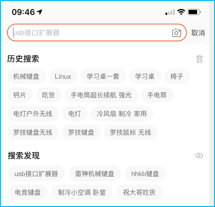


如果你喜欢听音乐：不难发现，也会根据你所听过的歌，给你推荐一些类型相似的歌


如果你喜欢看电视或着电影：


会根据你在看的和历史看的记录，给你推荐一些相似的视频：


如果你经常泡在博客系统或者其他看书的网站会发现也会有推荐：


等等，这些都是推荐，只是推荐的方法不一样。

可以根据用户的特征推荐，也可以根据物品的特征推荐。

这就是传说中的`基于用户`的推荐系统和`基于物品`的推荐系统。


# 二、利用数学解决相似度问题

## （一）概念

如下图所示：

> 从下图中就可以看出来A与D的夹角完全重合了，说明了什么呢？
>
> > 说明了，这俩相似度高。
>
> 再看一下D和B，和D和C；
>
> 根据这两对来比较的话，D与B的相似度要比D与C要高。


我们就可以`利用这种求夹角的问题`，来`解决相似度的问题`。


## （二）举例说明如何使用余弦定理解决相似度问题


**例子：**

例如原来有下面几位朋友，他们的身高和身上带着的金钱分别为：

| 姓名         | 身高（厘米） | 金钱(元） |
| ------------ | ------------ | --------- |
| 胡八一       | 185          | 532       |
| 二龙湖浩哥   | 179          | 550       |
| 喜洋洋       | 156          | 143       |
| 东北酒神九哥 | 210          | 340       |


突然有一天来了一个新朋友（假设就是你），名字叫`肖能逗`，身高`178`,身上带着`540`元。


假设现在你已经穿越到了未来，可以一眼就看出来上面的信息，`你该去和谁主动交朋友`？


经过一顿很猛的操作，你看出来了`二龙湖浩哥`跟你的信息是最接近的，那你就可以去跟浩哥交朋友。


来看这个图：

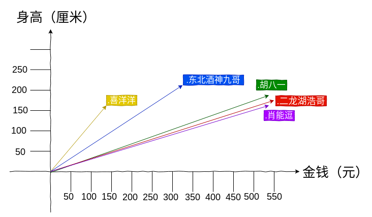


可以看到`肖能逗`与二龙湖浩哥的信息是最贴近的，因为他们的夹角小。所以一定推荐的就是`二龙湖浩哥`了。


整个过程是：

利用余弦定理去计算`肖能逗`与`其余所有人的值`，这个值越小，说明越相似，相似度越高。


## （三）利用余弦定理来解决相似度的问题


如下图：看到此图应该很熟悉了吧，是一个三角形；


我们在求这些夹角时，可以使用如下余弦定理公式：


 


**但是我们`只有2个维度的值`，分别为`身高`,`金钱`，而如上所示的计算夹角的公式，需要三个唯独的值，所以上面这种方式不能满足我们的需求，我们继续推导一下：** 


**`继续推导该公式`：**
$$
cos(θ)={\color{Red}  \frac{a\cdot b }{|a||b|}}
$$


**向量的点积公式：**
$$
a\cdot b =x1x2+y1y2
$$


**绝对值推导**:
$$
|a| =\sqrt{a^{2}}
$$


把这俩带入到第一个里面，就可以得出：
$$
cos(θ)={\color{Red}  \frac{x1x2+y1y2 }{\sqrt{x_{1}^{2}+y_{1}^{2}}  \sqrt{x_{2}^{2}+y_{2}^{2}}}}
$$


这样的话，就可以计算出来2个维度的数据了。


`但是如果有N个维度的数据该怎么办？`


**我们继续推导：**

> 这就得出了我们可以求N个数据维度的余弦定理公式。
>
> 我们只需要套进去这个公式，就可以求出我们想要的相似度对比数据（也就是夹角的数据）。


$$
cos(θ)={\color{Red}  \frac{\sum_{i=1}^{n}(x_{i}\times y_{i})}{
\sqrt{\sum_{i=1}^{n}(x_{i})^{2}} \times \sqrt{\sum_{i=1}^{n}(y_{i})^{2}} }}
$$


套公式时，我们需要给出两个数列例如：

`当前`用户的：`[1,2,3,4,5,6,7]`

`其他`用户的：`[1,5,6,7,8,9,0]`


如果是N个用户的话，那就可以把当前用户的数据与其余所有用户的数据都对比一下。


如下图所示，是我使用三组数据做的对比:`结果很明显`

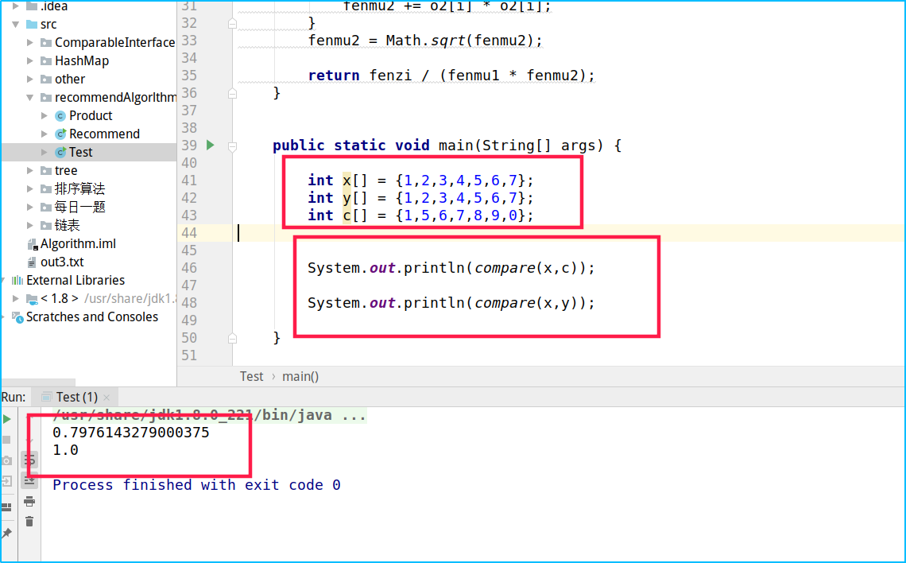


## （四）编程实现该算法核心代码

说是算法，不如说就是计算一个数据。都没毛病。

**如下代码所示，就是我用java代码实现的该算法，分别去求一下分子和分母，然后这个最终得出的数据，就是我们最终想要的。**

****

```java
private static Double compare(int[] o1, int[] o2) {

    //分子求和
    Double fenzi = 0.0 ;

    for (int i = 0; i < o1.length; i++) {
        fenzi += o1[i]*o2[i];
    }


    //分母第一部分
    Double fenmu1 = 0.0;
    for (int i = 0; i < o1.length; i++) {
        fenmu1 += o1[i] * o1[i];
    }

    fenmu1 = Math.sqrt(fenmu1);

    //分母第二部分
    Double fenmu2 = 0.0;
    for (int i = 0; i < o2.length; i++) {
        fenmu2 += o2[i] * o2[i];
    }
    fenmu2 = Math.sqrt(fenmu2);

    return fenzi / (fenmu1 * fenmu2);
}
```


# 三、(准备数据)爬取淘宝商品数据，来实现我们想要的功能（根据用户购买的商品，推荐出可能需要的商品）

## （一）准备数据

我们就以`农产品`为例子，来爬取我们想要的数据。

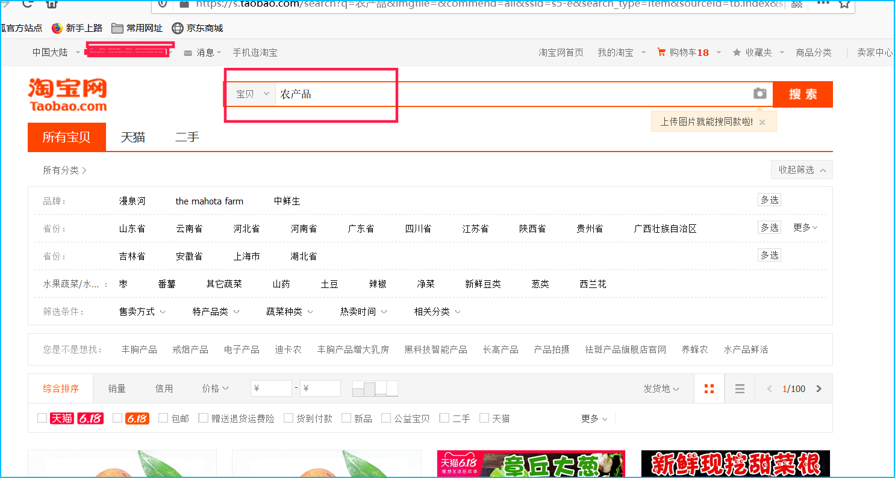


我们先找出重要的数据：

例如：`付款人数`、`售价`

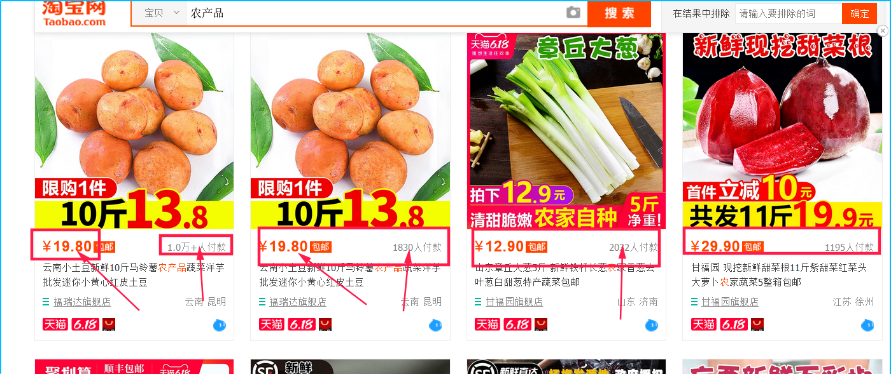


点进去可以看到，有：`评价数量`、`收藏人数`

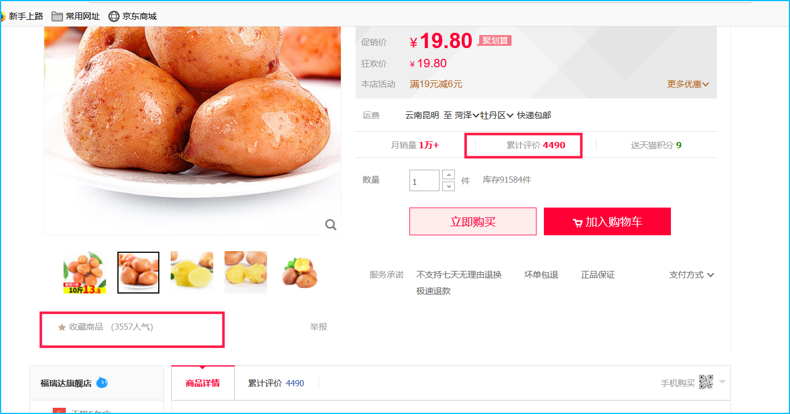


我们可以利用python或者其他手段进行爬取数据：

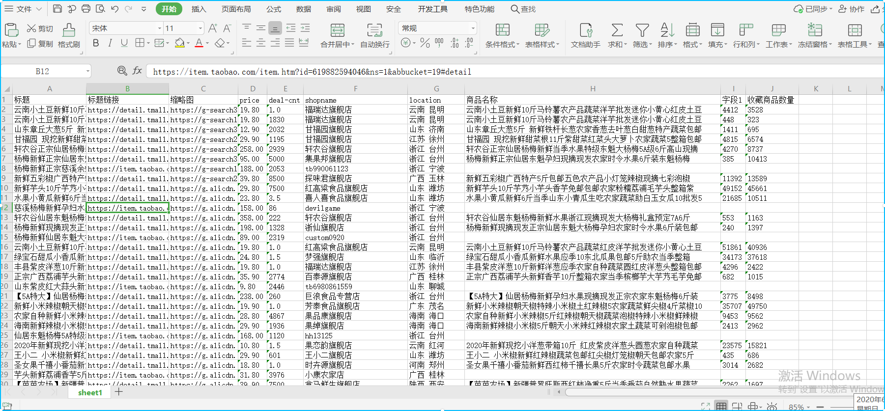


我这里爬去到了70多条：

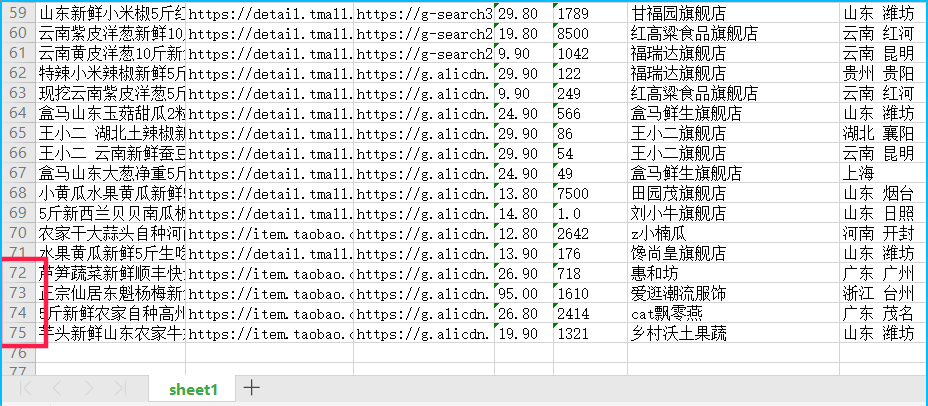


处理完数据导入数据库之后还剩下40多条数据：

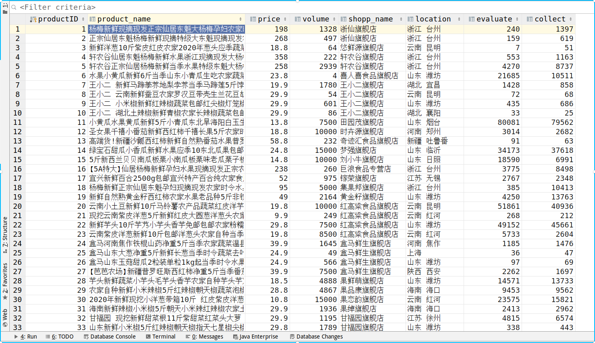


我们还有用户表：

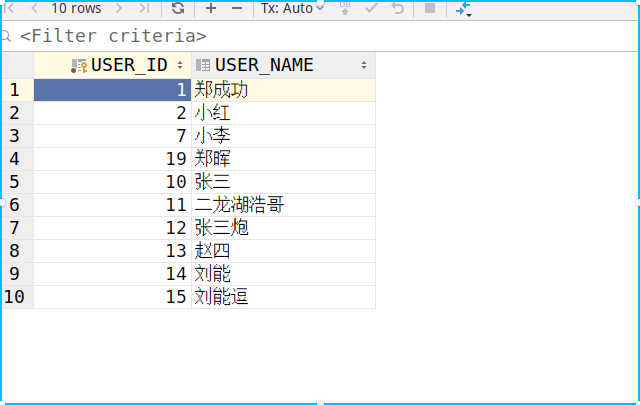


还有订单表

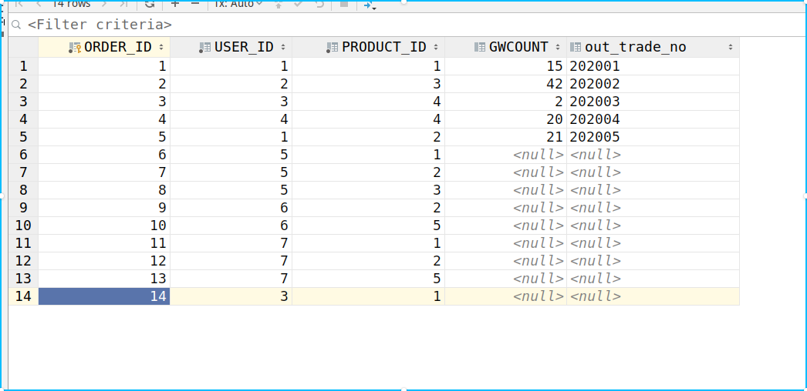


## （二）准备数据库表结构


### 1、会员用户表

```sql
create table member_user
(
    USER_ID   int(10) auto_increment
        primary key,
    USER_NAME varchar(20) null
)
    engine = MyISAM
    charset = utf8;

INSERT INTO testdb.member_user (USER_ID, USER_NAME) VALUES (1, '郑成功');
INSERT INTO testdb.member_user (USER_ID, USER_NAME) VALUES (2, '小红');
INSERT INTO testdb.member_user (USER_ID, USER_NAME) VALUES (7, '小李');
INSERT INTO testdb.member_user (USER_ID, USER_NAME) VALUES (19, '郑晖');
INSERT INTO testdb.member_user (USER_ID, USER_NAME) VALUES (10, '张三');
INSERT INTO testdb.member_user (USER_ID, USER_NAME) VALUES (11, '二龙湖浩哥');
INSERT INTO testdb.member_user (USER_ID, USER_NAME) VALUES (12, '张三炮');
INSERT INTO testdb.member_user (USER_ID, USER_NAME) VALUES (13, '赵四');
INSERT INTO testdb.member_user (USER_ID, USER_NAME) VALUES (14, '刘能');
INSERT INTO testdb.member_user (USER_ID, USER_NAME) VALUES (15, '刘能逗');
```


### 2、用户订单表

```sql
create table product_order
(
    ORDER_ID     int auto_increment
        primary key,
    USER_ID      int          not null,
    PRODUCT_ID   int          not null,
    GWCOUNT      int          null,
    out_trade_no varchar(100) null
);

INSERT INTO testdb.product_order (ORDER_ID, USER_ID, PRODUCT_ID, GWCOUNT, out_trade_no) VALUES (1, 1, 1, 15, '202001');
INSERT INTO testdb.product_order (ORDER_ID, USER_ID, PRODUCT_ID, GWCOUNT, out_trade_no) VALUES (2, 2, 3, 42, '202002');
INSERT INTO testdb.product_order (ORDER_ID, USER_ID, PRODUCT_ID, GWCOUNT, out_trade_no) VALUES (3, 3, 4, 2, '202003');
INSERT INTO testdb.product_order (ORDER_ID, USER_ID, PRODUCT_ID, GWCOUNT, out_trade_no) VALUES (4, 4, 4, 20, '202004');
INSERT INTO testdb.product_order (ORDER_ID, USER_ID, PRODUCT_ID, GWCOUNT, out_trade_no) VALUES (5, 1, 2, 21, '202005');
INSERT INTO testdb.product_order (ORDER_ID, USER_ID, PRODUCT_ID, GWCOUNT, out_trade_no) VALUES (6, 5, 1, null, null);
INSERT INTO testdb.product_order (ORDER_ID, USER_ID, PRODUCT_ID, GWCOUNT, out_trade_no) VALUES (7, 5, 2, null, null);
INSERT INTO testdb.product_order (ORDER_ID, USER_ID, PRODUCT_ID, GWCOUNT, out_trade_no) VALUES (8, 5, 3, null, null);
INSERT INTO testdb.product_order (ORDER_ID, USER_ID, PRODUCT_ID, GWCOUNT, out_trade_no) VALUES (9, 6, 2, null, null);
INSERT INTO testdb.product_order (ORDER_ID, USER_ID, PRODUCT_ID, GWCOUNT, out_trade_no) VALUES (10, 6, 5, null, null);
INSERT INTO testdb.product_order (ORDER_ID, USER_ID, PRODUCT_ID, GWCOUNT, out_trade_no) VALUES (11, 7, 1, null, null);
INSERT INTO testdb.product_order (ORDER_ID, USER_ID, PRODUCT_ID, GWCOUNT, out_trade_no) VALUES (12, 7, 2, null, null);
INSERT INTO testdb.product_order (ORDER_ID, USER_ID, PRODUCT_ID, GWCOUNT, out_trade_no) VALUES (13, 7, 5, null, null);
INSERT INTO testdb.product_order (ORDER_ID, USER_ID, PRODUCT_ID, GWCOUNT, out_trade_no) VALUES (14, 3, 1, null, null);
```


### 3、商品信息表

```sql
create table product_table
(
    productID    int auto_increment comment '商品ID'
        primary key,
    product_name varchar(200) charset utf8 null comment '商品名字',
    price        double                    null comment '商品金额',
    volume       int                       null comment '成交数量',
    shopp_name   varchar(100) charset utf8 null comment '商店名称',
    location     varchar(100) charset utf8 null comment '生产地',
    evaluate     int                       null comment '好评数量',
    collect      int default 0             null comment '收藏数量'
)
    engine = MyISAM
    collate = utf8_unicode_ci;

INSERT INTO testdb.product_table (productID, product_name, price, volume, shopp_name, location, evaluate, collect) VALUES (1, '杨梅新鲜现摘现发正宗仙居东魁大杨梅孕妇农家时令水果6斤装包邮', 198, 1328, '浙仙旗舰店', '浙江 台州', 240, 1397);
INSERT INTO testdb.product_table (productID, product_name, price, volume, shopp_name, location, evaluate, collect) VALUES (2, '正宗仙居东魁杨梅新鲜现摘特级大东魁现摘现发农家时令水5斤精选', 268, 497, '浙仙旗舰店', '浙江 台州', 159, 619);
INSERT INTO testdb.product_table (productID, product_name, price, volume, shopp_name, location, evaluate, collect) VALUES (3, '新鲜洋葱10斤紫皮红皮农家2020年葱头应季蔬菜圆头整箱批发包邮', 18.8, 64, '悠鲜源旗舰店', '云南 昆明', 7, 51);
INSERT INTO testdb.product_table (productID, product_name, price, volume, shopp_name, location, evaluate, collect) VALUES (4, '轩农谷仙居东魁杨梅新鲜水果浙江现摘现发大杨梅礼盒预定7A6斤', 358, 222, '轩农谷旗舰店', '浙江 台州', 553, 1163);
INSERT INTO testdb.product_table (productID, product_name, price, volume, shopp_name, location, evaluate, collect) VALUES (5, '轩农谷正宗仙居杨梅新鲜当季水果特级东魁大杨梅5A级6斤高山现摘', 258, 2939, '轩农谷旗舰店', '浙江 台州', 4270, 8737);
INSERT INTO testdb.product_table (productID, product_name, price, volume, shopp_name, location, evaluate, collect) VALUES (6, '水果小黄瓜新鲜6斤当季山东小青瓜生吃农家蔬菜助白玉女瓜10批发5', 23.8, 4, '喜人喜食品旗舰店', '山东 潍坊', 21685, 10511);
INSERT INTO testdb.product_table (productID, product_name, price, volume, shopp_name, location, evaluate, collect) VALUES (7, '王小二 新鲜马蹄荸荠地梨孛荠当季马蹄莲5斤饽荠农家自种蔬菜包邮', 19.9, 1780, '王小二旗舰店', '湖北 宜昌', 1428, 858);
INSERT INTO testdb.product_table (productID, product_name, price, volume, shopp_name, location, evaluate, collect) VALUES (8, '王小二 云南新鲜蚕豆农家罗汉豆带壳生兰花豆胡豆豌豆蔬菜包邮5斤', 29.9, 54, '王小二旗舰店', '云南 昆明', 72, 68);
INSERT INTO testdb.product_table (productID, product_name, price, volume, shopp_name, location, evaluate, collect) VALUES (9, '王小二 小米椒新鲜红辣椒蔬菜包邮红尖椒灯笼椒朝天包邮农家5斤', 29.9, 601, '王小二旗舰店', '山东 潍坊', 435, 686);
INSERT INTO testdb.product_table (productID, product_name, price, volume, shopp_name, location, evaluate, collect) VALUES (10, '王小二 湖北土辣椒新鲜青椒农家长辣椒蔬菜包邮尖椒批发特产5斤', 29.9, 86, '王小二旗舰店', '湖北 襄阳', 33, 25);
INSERT INTO testdb.product_table (productID, product_name, price, volume, shopp_name, location, evaluate, collect) VALUES (11, '小黄瓜水果黄瓜新鲜5斤小青瓜东北旱海阳白玉生吃10山东农家蔬菜', 13.8, 7500, '田园茂旗舰店', '山东 烟台', 80081, 79562);
INSERT INTO testdb.product_table (productID, product_name, price, volume, shopp_name, location, evaluate, collect) VALUES (12, '圣女果千禧小番茄新鲜西红柿千禧长果5斤农家时令蔬菜包邮水果', 18.8, 10000, '时卉源旗舰店', '河南 郑州', 3014, 2682);
INSERT INTO testdb.product_table (productID, product_name, price, volume, shopp_name, location, evaluate, collect) VALUES (13, '高端货!新疆沙瓤西红柿新鲜自然熟番茄水果普罗旺斯农家顺丰包邮', 58.8, 232, '奇迹汇食品旗舰店', '新疆 吐鲁番', 91, 63);
INSERT INTO testdb.product_table (productID, product_name, price, volume, shopp_name, location, evaluate, collect) VALUES (14, '绿宝石甜瓜小香瓜新鲜水果应季10东北瓜果包邮5斤助农当季整箱', 24.8, 15000, '梦强旗舰店', '山东 临沂', 34173, 37618);
INSERT INTO testdb.product_table (productID, product_name, price, volume, shopp_name, location, evaluate, collect) VALUES (15, '5斤新西兰贝贝南瓜板栗小南瓜板栗味老瓜栗子板粟10农家新鲜带箱', 14.8, 10000, '刘小牛旗舰店', '山东 日照', 18590, 6991);
INSERT INTO testdb.product_table (productID, product_name, price, volume, shopp_name, location, evaluate, collect) VALUES (16, '【5A特大】仙居杨梅新鲜孕妇水果现摘现发正宗农家东魁杨梅6斤装', 238, 260, '巨浪食品专营店', '浙江 台州', 3775, 8498);
INSERT INTO testdb.product_table (productID, product_name, price, volume, shopp_name, location, evaluate, collect) VALUES (17, '宜兴新鲜百合2500g包邮宜兴特产百合纯农家食用大白合5斤30个左右', 52, 975, '镓荣旗舰店', '江苏 无锡', 2767, 2348);
INSERT INTO testdb.product_table (productID, product_name, price, volume, shopp_name, location, evaluate, collect) VALUES (18, '杨梅新鲜正宗仙居东魁孕妇现摘现发农家时令水果6斤装东魁杨梅', 95, 5000, '集果邦旗舰店', '浙江 台州', 385, 10413);
INSERT INTO testdb.product_table (productID, product_name, price, volume, shopp_name, location, evaluate, collect) VALUES (19, '新鲜自然熟黄金籽西红柿农家水果老品种5斤非铁皮博士番茄沙瓤', 49, 2164, '黄金籽旗舰店', '山东 潍坊', 4250, 13763);
INSERT INTO testdb.product_table (productID, product_name, price, volume, shopp_name, location, evaluate, collect) VALUES (20, '云南小土豆新鲜10斤马铃薯农产品蔬菜红皮洋芋批发迷你小黄心土豆', 19.8, 10000, '红高粱食品旗舰店', '云南 昆明', 51861, 40936);
INSERT INTO testdb.product_table (productID, product_name, price, volume, shopp_name, location, evaluate, collect) VALUES (21, '现挖云南紫皮洋葱5斤新鲜红皮大圆葱洋葱头农家自种特产蔬菜包邮', 9.9, 249, '红高粱食品旗舰店', '云南 红河', 268, 212);
INSERT INTO testdb.product_table (productID, product_name, price, volume, shopp_name, location, evaluate, collect) VALUES (22, '新鲜芋头10斤芋艿小芋头香芋免邮包邮农家粉糯荔浦毛芋头整箱紫', 29.8, 7500, '红高粱食品旗舰店', '山东 潍坊', 49152, 45661);
INSERT INTO testdb.product_table (productID, product_name, price, volume, shopp_name, location, evaluate, collect) VALUES (23, '云南紫皮洋葱新鲜10斤包邮洋葱头农家自种当季蔬菜红皮大圆葱整箱', 19.8, 8500, '红高粱食品旗舰店', '云南 红河', 5733, 2604);
INSERT INTO testdb.product_table (productID, product_name, price, volume, shopp_name, location, evaluate, collect) VALUES (24, '盒马河南焦作铁棍山药净重5斤当季农家蔬菜温县新鲜山药包邮', 39.9, 1645, '盒马鲜生旗舰店', '河南 焦作', 1185, 1476);
INSERT INTO testdb.product_table (productID, product_name, price, volume, shopp_name, location, evaluate, collect) VALUES (25, '盒马山东大葱净重5斤新鲜长葱当季时令蔬菜去叶白香葱产地农产品', 24.9, 49, '盒马鲜生旗舰店', '上海', 36, 47);
INSERT INTO testdb.product_table (productID, product_name, price, volume, shopp_name, location, evaluate, collect) VALUES (26, '盒马山东玉菇甜瓜2粒装单粒1kg起当季时令水果新鲜甜瓜蜜瓜', 24.9, 566, '盒马鲜生旗舰店', '山东 潍坊', 97, 69);
INSERT INTO testdb.product_table (productID, product_name, price, volume, shopp_name, location, evaluate, collect) VALUES (27, '【芭芭农场】新疆普罗旺斯西红柿净重5斤当季番茄自然熟水果蔬菜', 39.9, 7500, '盒马鲜生旗舰店', '陕西 西安', 2262, 1697);
INSERT INTO testdb.product_table (productID, product_name, price, volume, shopp_name, location, evaluate, collect) VALUES (28, '芋头新鲜蔬菜小芋头毛芋头香芋农家自种芋头芋艿非荔浦芋头5斤10', 18.5, 4888, '果鲜萌旗舰店', '山东 潍坊', 14571, 13733);
INSERT INTO testdb.product_table (productID, product_name, price, volume, shopp_name, location, evaluate, collect) VALUES (29, '农家自种新鲜小米辣椒5斤红辣椒朝天椒蔬菜泡椒特辣小米椒鲜辣椒', 28.8, 4867, '果品康旗舰店', '海南 海口', 9453, 9562);
INSERT INTO testdb.product_table (productID, product_name, price, volume, shopp_name, location, evaluate, collect) VALUES (30, '2020年新鲜现挖小洋葱带箱10斤 红皮紫皮洋葱头圆葱农家自种蔬菜', 10.8, 15000, '果恋韵旗舰店', '云南 红河', 23575, 15821);
INSERT INTO testdb.product_table (productID, product_name, price, volume, shopp_name, location, evaluate, collect) VALUES (31, '海南新鲜辣椒小米椒5斤朝天小米辣红辣椒农家土蔬菜可剁泡椒包邮', 29.9, 1936, '果绰旗舰店', '海南 海口', 2413, 2962);
INSERT INTO testdb.product_table (productID, product_name, price, volume, shopp_name, location, evaluate, collect) VALUES (32, '甘福园 现挖新鲜甜菜根11斤紫甜菜红菜头大萝卜农家蔬菜5整箱包邮', 29.9, 1195, '甘福园旗舰店', '江苏 徐州', 4815, 6574);
INSERT INTO testdb.product_table (productID, product_name, price, volume, shopp_name, location, evaluate, collect) VALUES (33, '山东新鲜小米椒5斤红辣椒朝天椒指天七星椒尖椒泡椒农家蔬菜包邮', 29.8, 1789, '甘福园旗舰店', '山东 潍坊', 338, 443);
INSERT INTO testdb.product_table (productID, product_name, price, volume, shopp_name, location, evaluate, collect) VALUES (34, '山东章丘大葱5斤 新鲜铁杆长葱农家香葱去叶葱白甜葱特产蔬菜包邮', 12.9, 2032, '甘福园旗舰店', '山东 济南', 1411, 695);
INSERT INTO testdb.product_table (productID, product_name, price, volume, shopp_name, location, evaluate, collect) VALUES (35, '现挖新鲜芦笋3斤当季农家蔬菜福建特产绿芦笋青笋春笋龙须菜包邮', 29.9, 637, '甘福园旗舰店', '福建 漳州', 1225, 907);
INSERT INTO testdb.product_table (productID, product_name, price, volume, shopp_name, location, evaluate, collect) VALUES (36, '丰县紫皮洋葱10斤新鲜洋葱应季农家自种蔬菜圆红皮洋葱头整箱包邮', 19.8, 10000, '福瑞达旗舰店', '江苏 徐州', 4296, 2422);
INSERT INTO testdb.product_table (productID, product_name, price, volume, shopp_name, location, evaluate, collect) VALUES (37, '云南小土豆新鲜10斤马铃薯农产品蔬菜洋芋批发迷你小黄心红皮土豆', 19.8, 10000, '福瑞达旗舰店', '云南 昆明', 4412, 3528);
INSERT INTO testdb.product_table (productID, product_name, price, volume, shopp_name, location, evaluate, collect) VALUES (38, '云南黄皮洋葱10斤新鲜蔬菜 当季农家自种圆葱头整箱批发包邮5', 9.9, 1042, '福瑞达旗舰店', '云南 昆明', 225, 230);
INSERT INTO testdb.product_table (productID, product_name, price, volume, shopp_name, location, evaluate, collect) VALUES (39, '特辣小米辣椒新鲜5斤 朝天椒应季农家蔬菜指天椒泡尖椒红辣椒包邮', 29.9, 122, '福瑞达旗舰店', '贵州 贵阳', 447, 449);
INSERT INTO testdb.product_table (productID, product_name, price, volume, shopp_name, location, evaluate, collect) VALUES (40, '云南小土豆新鲜10斤马铃薯农产品蔬菜洋芋批发迷你小黄心红皮土豆', 19.8, 1830, '福瑞达旗舰店', '云南 昆明', 448, 323);
INSERT INTO testdb.product_table (productID, product_name, price, volume, shopp_name, location, evaluate, collect) VALUES (41, '新鲜小米辣椒朝天椒特辣小米椒土红辣椒5农家蔬菜鲜尖椒4斤菜椒10', 19.9, 10000, '芳泰食品旗舰店', '广东 茂名', 35707, 49750);
INSERT INTO testdb.product_table (productID, product_name, price, volume, shopp_name, location, evaluate, collect) VALUES (42, '水果黄瓜新鲜5斤生吃脆嫩旱黄瓜山东农家蔬菜凉拌小青瓜当季包邮', 13.9, 176, '馋尚皇旗舰店', '山东 潍坊', 16, 73);
INSERT INTO testdb.product_table (productID, product_name, price, volume, shopp_name, location, evaluate, collect) VALUES (43, '西红柿陕西农家生吃新鲜沙瓤自然熟蔬菜水果番茄5/10斤带箱包邮', 24.9, 947, '璨掌柜旗舰店', '陕西 咸阳', 364, 223);
INSERT INTO testdb.product_table (productID, product_name, price, volume, shopp_name, location, evaluate, collect) VALUES (44, '正宗广西荔浦芋头新鲜香芋10斤整箱农家当季槟榔芋大芋艿毛芋免邮', 35.9, 2774, '百泰源旗舰店', '广西 桂林', 682, 1015);
INSERT INTO testdb.product_table (productID, product_name, price, volume, shopp_name, location, evaluate, collect) VALUES (45, '云南土豆新鲜10斤大号红皮黄心农家自种小蔬菜产品包邮马铃薯洋芋', 19.8, 3597, '阿朴食品旗舰店', '云南 曲靖', 772, 805);
```


# 四、实战java项目实现该功能

## （一）项目目录结构


**`由于代码量比较多，这里就不一一的贴出来了，都贴出来也没意思，这里只把重要的代码贴出来`**


## （二）数据库帮助类(操作数据库)

> 每个接口都有注释，很清楚，代码也比较简单

```java
package com.db;

import com.entity.MemberUser;
import com.entity.ProductOrder;
import com.entity.ProductTable;

import java.sql.*;
import java.util.ArrayList;
import java.util.List;

public class DBHelp {


	static String url = "jdbc:mysql://127.0.0.1:3306/testdb";
	static String user= "root";
	static String password= "123456";


	static {
		try {
			Class.forName("com.mysql.jdbc.Driver");
			
		} catch (ClassNotFoundException e) {
			e.printStackTrace();
		}
	}
	
	public static Connection getConnection() {
		try {
			return DriverManager.getConnection(url, user, password);
		} catch (SQLException e) {
			e.printStackTrace();
		}
		return null;
	}


	static Connection conn = DBHelp.getConnection();
	static Statement st = null;
	static ResultSet rs = null;


	/**
	 * 获取所有的商品信息
	 * @return
	 * @param sqlId
	 */
	public static List<ProductTable> getProductList(String sqlId){

		List<ProductTable> productTables = new ArrayList<>();

		try {
			st = conn.createStatement();
			rs = st.executeQuery("select * from product_table where productID in ("+sqlId+")");

			while (rs.next()){
				productTables.add(new ProductTable(
						rs.getInt("productID"),
						rs.getString("product_name"),
						rs.getDouble("price"),
						rs.getInt("volume"),
						rs.getString("shopp_name"),
						rs.getString("location"),
						rs.getInt("evaluate"),
						rs.getInt("collect")));
			}

		} catch (SQLException e) {
			e.printStackTrace();
		}

		return productTables;
	}

	//获取用户订单信息
	public static List<ProductOrder> getProductOrderList(Integer userId){
		List<ProductOrder> productTables = new ArrayList<>();

//		String sql = "select * from product_order where USER_ID=(select USER_ID from member_user where USER_NAME=\""+name+"\")";

		String sql = "select * from product_order "+(userId==null?"":"where USER_ID="+userId);
//		System.out.println("执行的 sql: "+sql);
		try {
			st = conn.createStatement();
			rs = st.executeQuery(sql);

			while (rs.next()){
				productTables.add(new ProductOrder(
						rs.getInt("order_id"),
						rs.getInt("user_id"),
						rs.getInt("product_id"),
						rs.getInt("gwcount")));
			}

		} catch (SQLException e) {
			e.printStackTrace();
		}

		return productTables;
	}

	//获取用户信息
	public static List<MemberUser> getMemberUserList(){
		List<MemberUser> productTables = new ArrayList<>();

		try {
			st = conn.createStatement();
			rs = st.executeQuery("select * from member_user");

			while (rs.next()){
				productTables.add(new MemberUser(
						rs.getInt("user_id"),
						rs.getString("user_name")));
			}

		} catch (SQLException e) {
			e.printStackTrace();
		}

		return productTables;
	}
}
```


## （三）计算时所用到的实体类


```java
package com.entity;

import java.util.Arrays;

/**
 * @Auther: truedei
 * @Date: 2020 /20-6-13 22:53
 * @Description:
 */
public class UserR {

    private String userName;

    private Integer userId;

    private Integer[] ProductIds;//存放每个用户所购买的商品的id

    private Double cos_th; //存储每个用户与当前用户所计算出来的cos值

    ....省略get和set方法
}

```


## （四）用户登录接口的实现

> 接口随便定义哈，我这里只是做实验，就随便起了个名字；
>
> 我的本意是在用户登录的时候，根据该用户的id去拿到该用户的订单数据，然后进行数据处理--推荐等

```java
/**
     * 登录后推荐接口
     * @param userId 模拟登录的用户ID
     */
public void login(Integer userId){

    //1，使用该用户的名字获取订单信息
    System.out.println("----------------");
    //查询登录用户的订单信息
    List<ProductOrder> productOrderList = DBHelp.getProductOrderList(userId);

    //存储个人 购买的所有的商品id
    Integer[] ints = new Integer[productOrderList.size()];

    //存储个人信息，封装成对象，方便计算
    UserR userR = new UserR();

    //筛选出来个人订单中的商品的id
    System.out.println("个人的：");
    for (int i = 0; i < productOrderList.size(); i++) {
        ints[i] = productOrderList.get(i).getProduct_id();
        System.out.println(productOrderList.get(i).toString());
    }
    userR.setUserId(productOrderList.get(0).getUser_id());
    userR.setProductIds(ints);


    //2,拿到所有用户的订单信息
    List<ProductOrder> productOrderLists = DBHelp.getProductOrderList(null);

    //存储所有人的订单信息
    List<UserR> userRS = new ArrayList<>();

    //利用map的机制，计算出来其余用户的所有的购买商品的id  Map<用户id，商品ID拼接的字符串(1,2,3,4)>
    Map<Integer,String> map = new HashMap<>();


    System.out.println("所有人的：");
    //筛选出来订单中的商品的id
    for (int i = 0; i < productOrderLists.size(); i++) {
        System.out.println(productOrderLists.get(i).toString());

        map.put(productOrderLists.get(i).getUser_id(),
                map.containsKey(productOrderLists.get(i).getUser_id())?
                map.get(productOrderLists.get(i).getUser_id())+","+productOrderLists.get(i).getProduct_id():
                productOrderLists.get(i).getProduct_id()+"");
    }

    //开始封装每个人的数据
    for (Integer key:map.keySet() ) {

        //new出来一个新的个人的对象，后面要塞到list中
        UserR userR2 = new UserR();

        //把其他每个人购买的商品的id 分割成数组
        String[] split = map.get(key).split(",");

        //转换成int数组 进行存储，方便后期计算
        Integer[] ints1 = new Integer[split.length];
        for (int i = 0; i < split.length; i++) {
            ints1[i] = Integer.valueOf(split[i]);
        }

        //用户id 就是key
        userR2.setUserId(key);
        //用户购买的商品id的数组
        userR2.setProductIds(ints1);

        //塞到list中
        userRS.add(userR2);
    }

    //二值化 处理数据
    List<UserR> userRList = jisuan(userR, userRS);

    System.out.println("得出的结果：");
    for (int i = 0; i < userRList.size(); i++) {
        System.out.println(userRList.get(i).toString());
    }

    System.out.println("过滤处理数据之后：");
    //过滤处理
    String sqlId = chuli(userRList, userR);

    System.out.println("推荐的商品：");
    //通过拿到的拼接的被推荐商品的id，去查数据库
    List<ProductTable> productList = DBHelp.getProductList(sqlId);
    //最终拿到被推荐商品的信息
    for (int i = 0; i < productList.size(); i++) {
        System.out.println(productList.get(i).toString());
    }

}
```


## （五）过滤数据接口的实现

> 因为存在着一些数据定是不可用的，所以我们要过滤处理掉之后的数据，就是我们想要的。

```java
 /**
     * 过滤处理
     * @param userRList 所有用户的订单数据
     * @param userR 当前登录用户的订单数据
     * @return
     */
private String chuli(List<UserR> userRList,UserR userR) {

    //为了方便下面过滤数据，预先把登录用户的订单购物的商品的id做一个map，在过滤的时候，只需要查一下map中是否存在key就ok
    Map<Integer,Integer> map1 = new HashMap<>();
    for (int i = 0; i < userR.getProductIds().length; i++) {
        map1.put(userR.getProductIds()[i],userR.getProductIds()[i]);
    }


    //盛放最终过滤出来的数据 Map<商品id,出现的次数>
    Map<Integer,Integer> map = new HashMap<>();

    for (int i = 0; i < userRList.size(); i++) {
        //userRList.get(i).getCos_th()>0：过滤掉相似度等于0，也就是完全不匹配的
        //userRList.get(i).getUserId()!=userR.getUserId()：过滤掉当前用户的订单信息
        if(userRList.get(i).getCos_th()>0 && userRList.get(i).getUserId()!=userR.getUserId()){
            //求当前登录用户的购买商品的id和其他用户的所购买商品的差集，例如：A=[1, 2],B=[1, 2, 3]  那么这个3就是最终想要的结果
            Integer[] j = QJ.getC(userRList.get(i).getProductIds(), userR.getProductIds());

            //遍历求差集之后的结果
            for (int i1 = 0; i1 < j.length; i1++) {
                //如果其余的用户所购买撒谎那个品的id不在当前用的所购买商品的id，那么就存起来
                if(!map1.containsKey(j[i1])){
                    //存储时，数量每次都+1，方便后面排序，出现的次数多，说明被推荐的机会越高
                    map.put(j[i1],map.containsKey(j[i1])?(map.get(j[i1])+1):1);
                }
            }
        }
    }


    System.out.println("处理之后的map：");
    for (Integer key:map.keySet()) {
        System.out.println("商品id="+key+"--用户所购数量="+map.get(key));
    }

    //把map进行降序排序
    Map<Integer, Integer> map2 = MapSortUtil.sortByKeyDesc(map);
    System.out.println("按降序" + map2);


    //拼接成一个sql，方便去查数据库
    String sqlId = "";
    for (Integer key:map2.keySet()) {
        sqlId = sqlId+key +",";
    }

    sqlId = sqlId.substring(0,sqlId.length()-1);

    System.out.println("最终拿到的被推荐给当前用户的商品id--->"+sqlId);

    return sqlId;
}
```


## （六）二值化数据库处理

> 这里是为了计起来方便，特意把数据进行二值化处理

```java

/**
     * 二值化 处理数据
     * @param userR 当前登录用户的订单信息
     * @param userRS 其他用户的订单信息
     * @return 二值化处理之后的结果
     */
private List<UserR> jisuan(UserR userR, List<UserR> userRS) {

    //对个人做二值化处理，为了好计算 [0,0,0,0,0,1,1,0,1]这种
    //个人的
    int userErzhihua[] = new int[10];
    for (int i = 0; i < userR.getProductIds().length; i++) {
        userErzhihua[userR.getProductIds()[i]]=1;
    }


    //库里所有人的
    int erzhihua[] = new int[10];
    //对其他人，做二值化处理，为了好计算 [0,0,0,0,0,1,1,0,1]这种
    for (int i = 0; i < userRS.size(); i++) {
        UserR product = userRS.get(i);
        for (int j = 0; j < product.getProductIds().length; j++) {
            erzhihua[product.getProductIds()[j]]=1;
        }
        //计算当前登录用户与其余每个人的余弦值 cos_th
        Double compare = compare( erzhihua,userErzhihua);
        product.setCos_th(compare);

        //把计算好的值，重新塞到原来的位置，替换到旧的数据
        userRS.set(i,product);

        //防止数组中的值重复，起到清空的作用
        erzhihua = new int[10];
    }

    return userRS;

}

```

## （七）核心计算相似度代码

```java
  /**
     * 代码核心内容
     * @param o1 当前登录用户的
     * @param o2 其他用户的 n1 n2 n3 n4 n....
     * @return
     */
private static Double compare(int[] o1, int[] o2) {
    //分子求和
    Double fenzi = 0.0 ;

    for (int i = 0; i < o1.length; i++) {
        fenzi += o1[i]*o2[i];
    }
    //分母第一部分
    Double fenmu1 = 0.0;
    for (int i = 0; i < o1.length; i++) {
        fenmu1 += o1[i] * o1[i];
    }
    fenmu1 = Math.sqrt(fenmu1);
    //分母第二部分
    Double fenmu2 = 0.0;
    for (int i = 0; i < o2.length; i++) {
        fenmu2 += o2[i] * o2[i];
    }
    fenmu2 = Math.sqrt(fenmu2);
    return fenzi / (fenmu1 * fenmu2);
}
```


# 五、测试结果

## （一）用户1推荐结果

使用用户id为1的用户登录：

```java
 login(1);
```


**计算结果：**

```java
----------------
个人的：
ProductOrder{order_id=1, user_id=1, product_id=1, gwcount=15}
ProductOrder{order_id=5, user_id=1, product_id=2, gwcount=21}
所有人的：
ProductOrder{order_id=1, user_id=1, product_id=1, gwcount=15}
ProductOrder{order_id=2, user_id=2, product_id=3, gwcount=42}
ProductOrder{order_id=3, user_id=3, product_id=4, gwcount=2}
ProductOrder{order_id=4, user_id=4, product_id=4, gwcount=20}
ProductOrder{order_id=5, user_id=1, product_id=2, gwcount=21}
ProductOrder{order_id=6, user_id=5, product_id=1, gwcount=0}
ProductOrder{order_id=7, user_id=5, product_id=2, gwcount=0}
ProductOrder{order_id=8, user_id=5, product_id=3, gwcount=0}
ProductOrder{order_id=9, user_id=6, product_id=2, gwcount=0}
ProductOrder{order_id=10, user_id=6, product_id=5, gwcount=0}
ProductOrder{order_id=11, user_id=7, product_id=1, gwcount=0}
ProductOrder{order_id=12, user_id=7, product_id=2, gwcount=0}
ProductOrder{order_id=13, user_id=7, product_id=5, gwcount=0}
ProductOrder{order_id=14, user_id=3, product_id=1, gwcount=0}
得出的结果：
UserR{userName='null', userId=1, ProductIds=[1, 2], cos_th=0.9999999999999998}
UserR{userName='null', userId=2, ProductIds=[3], cos_th=0.0}
UserR{userName='null', userId=3, ProductIds=[4, 1], cos_th=0.4999999999999999}
UserR{userName='null', userId=4, ProductIds=[4], cos_th=0.0}
UserR{userName='null', userId=5, ProductIds=[1, 2, 3], cos_th=0.8164965809277259}
UserR{userName='null', userId=6, ProductIds=[2, 5], cos_th=0.4999999999999999}
UserR{userName='null', userId=7, ProductIds=[1, 2, 5], cos_th=0.8164965809277259}
过滤处理数据之后：
处理之后的map：
商品id=3--用户所购数量=1
商品id=4--用户所购数量=1
商品id=5--用户所购数量=2
按降序{5=2, 4=1, 3=1}
最终拿到的被推荐给当前用户的商品id--->5,4,3
推荐的商品：
ProductTable{productID=3, product_name='新鲜洋葱10斤紫皮红皮农家2020年葱头应季蔬菜圆头整箱批发包邮', price=18.8, volume=64, shopp_name='悠鲜源旗舰店', location='云南 昆明', evaluate=7, collect=51}
ProductTable{productID=4, product_name='轩农谷仙居东魁杨梅新鲜水果浙江现摘现发大杨梅礼盒预定7A6斤', price=358.0, volume=222, shopp_name='轩农谷旗舰店', location='浙江 台州', evaluate=553, collect=1163}
ProductTable{productID=5, product_name='轩农谷正宗仙居杨梅新鲜当季水果特级东魁大杨梅5A级6斤高山现摘', price=258.0, volume=2939, shopp_name='轩农谷旗舰店', location='浙江 台州', evaluate=4270, collect=8737}
```


可以看到推荐的结果是：`3,4,5`号商品

```java
推荐的商品：
ProductTable{productID=3, product_name='新鲜洋葱10斤紫皮红皮农家2020年葱头应季蔬菜圆头整箱批发包邮', price=18.8, volume=64, shopp_name='悠鲜源旗舰店', location='云南 昆明', evaluate=7, collect=51}
ProductTable{productID=4, product_name='轩农谷仙居东魁杨梅新鲜水果浙江现摘现发大杨梅礼盒预定7A6斤', price=358.0, volume=222, shopp_name='轩农谷旗舰店', location='浙江 台州', evaluate=553, collect=1163}
ProductTable{productID=5, product_name='轩农谷正宗仙居杨梅新鲜当季水果特级东魁大杨梅5A级6斤高山现摘', price=258.0, volume=2939, shopp_name='轩农谷旗舰店', location='浙江 台州', evaluate=4270, collect=8737}
```


我们可以看到相似度为：

```java
UserR{userName='null', userId=1, ProductIds=[1, 2], cos_th=0.9999999999999998}
UserR{userName='null', userId=2, ProductIds=[3], cos_th=0.0}
UserR{userName='null', userId=3, ProductIds=[4, 1], cos_th=0.4999999999999999}
UserR{userName='null', userId=4, ProductIds=[4], cos_th=0.0}
UserR{userName='null', userId=5, ProductIds=[1, 2, 3], cos_th=0.8164965809277259}
UserR{userName='null', userId=6, ProductIds=[2, 5], cos_th=0.4999999999999999}
UserR{userName='null', userId=7, ProductIds=[1, 2, 5], cos_th=0.8164965809277259}
```

通过过滤，得出：

```java
UserR{userName='null', userId=3, ProductIds=[4, 1], cos_th=0.4999999999999999}
UserR{userName='null', userId=5, ProductIds=[1, 2, 3], cos_th=0.8164965809277259}
UserR{userName='null', userId=6, ProductIds=[2, 5], cos_th=0.4999999999999999}
UserR{userName='null', userId=7, ProductIds=[1, 2, 5], cos_th=0.8164965809277259}
```

最终去除重复的，去除原账户已有的，就是我们想要的结果：`4,3,5`


## （二）用户2推荐结果

```java
----------------
个人的：
ProductOrder{order_id=2, user_id=2, product_id=3, gwcount=42}
所有人的：
ProductOrder{order_id=1, user_id=1, product_id=1, gwcount=15}
ProductOrder{order_id=2, user_id=2, product_id=3, gwcount=42}
ProductOrder{order_id=3, user_id=3, product_id=4, gwcount=2}
ProductOrder{order_id=4, user_id=4, product_id=4, gwcount=20}
ProductOrder{order_id=5, user_id=1, product_id=2, gwcount=21}
ProductOrder{order_id=6, user_id=5, product_id=1, gwcount=0}
ProductOrder{order_id=7, user_id=5, product_id=2, gwcount=0}
ProductOrder{order_id=8, user_id=5, product_id=3, gwcount=0}
ProductOrder{order_id=9, user_id=6, product_id=2, gwcount=0}
ProductOrder{order_id=10, user_id=6, product_id=5, gwcount=0}
ProductOrder{order_id=11, user_id=7, product_id=1, gwcount=0}
ProductOrder{order_id=12, user_id=7, product_id=2, gwcount=0}
ProductOrder{order_id=13, user_id=7, product_id=5, gwcount=0}
ProductOrder{order_id=14, user_id=3, product_id=1, gwcount=0}
得出的结果：
UserR{userName='null', userId=1, ProductIds=[1, 2], cos_th=0.0}
UserR{userName='null', userId=2, ProductIds=[3], cos_th=1.0}
UserR{userName='null', userId=3, ProductIds=[4, 1], cos_th=0.0}
UserR{userName='null', userId=4, ProductIds=[4], cos_th=0.0}
UserR{userName='null', userId=5, ProductIds=[1, 2, 3], cos_th=0.5773502691896258}
UserR{userName='null', userId=6, ProductIds=[2, 5], cos_th=0.0}
UserR{userName='null', userId=7, ProductIds=[1, 2, 5], cos_th=0.0}
过滤处理数据之后：
处理之后的map：
商品id=1--用户所购数量=1
商品id=2--用户所购数量=1
按降序{2=1, 1=1}
最终拿到的被推荐给当前用户的商品id--->2,1
推荐的商品：
ProductTable{productID=1, product_name='杨梅新鲜现摘现发正宗仙居东魁大杨梅孕妇农家时令水果6斤装包邮', price=198.0, volume=1328, shopp_name='浙仙旗舰店', location='浙江 台州', evaluate=240, collect=1397}
ProductTable{productID=2, product_name='正宗仙居东魁杨梅新鲜现摘特级大东魁现摘现发农家时令水5斤精选', price=268.0, volume=497, shopp_name='浙仙旗舰店', location='浙江 台州', evaluate=159, collect=619}
```

